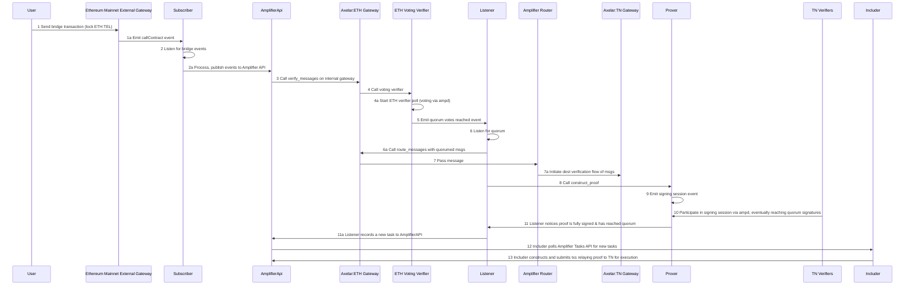

# Telcoin-Network Cross-Chain Bridge Relayers

## Relayer High-Level Flow:



1. user sends bridge tx to eth mainnet gateway causing a `ContractCall` event to be emitted (1a)
2. Subscriber is listening for these events and picks up event 1a, processing it and submitting it to Amplifier API (2a)
3. Axelar internally calls `verify_messages` on Axelar (internal) gateway contract for eth
4. Axelar:eth internal gateway calls voting verifier, which starts ETH verifier voting poll via ampd (4a)
5. once quorum of votes are cast for the message, an event is emitted.
6. another axelar-specific relayer "Listener" listens for this event to call `route_messages` on Axelar:eth gateway (6a)
7. chain’s Axelar gateway passes the message to the Amplifier router, which then passes it on to Axelar:TN gateway (7a)
8. Listener calls `construct_proof` to start the process of creating a signed batch that can be relayed back to eth as well as pass the now-outbound message from the Axelar:TN gateway to the prover.
9. prover starts a signing session with the multisig contract by emitting event
10. noticing the event, TN verifiers participate in the signing session via ampd
11. once quorum signatures are submitted, Listener records a new valid `taskID` to the Amplifier Tasks API (11a)
12. Includer polls Amplifier Tasks API for new valid `tasks`
13. Includer relays new valid `tasks` which contain fully signed proofs (from the prover) to TN to be executed via transactions on TN.

System Diagram (omitting GMP API)


## The Subscriber

The Subscriber can be configured at runtime with the flags below.

`--target-chain`: The chain at which to point the subscriber
`--target-contract`: The specific contract to which to subscribe; may be an external gateway or AxelarGMPExecutable

For example, to run the Subscriber set up to subscribe to `ContractCall` events from the RWTEL module on Telcoin Network:

```bash
npm run subscriber -- --target-chain telcoin-network --target-contract 0xca568d148d23a4ca9b77bef783dca0d2f5962c12
```

### Subscriber spec:

The Subscriber’s job is to guarantee that every protocol event on the Amplifier chain is detected and successfully published to the GMP API. The relayer detects outgoing GMP messages from the chain to the AVM and publishes them to the GMP API so that they can be verified, routed, signed, and delivered to the destination chain.

- subscribe to external eth gateway, hooking into onchain events
- filter for `ContractCall(address indexed sender, string destinationChain, string destinationContractAddress, bytes32 indexed payloadHash, bytes payload)`
- ensure target function is `execute(bytes32 commandId, string calldata sourceChain, string calldatasourceAddress, bytes calldata payload)` ?
- publish to amplifier GMP API via `fetch()` & using CallEvent schema, obtain confirmation response

## The Includer

The Includer can be configured at runtime with the flags below.

`--destination-chain`: The chain to transact tasks on
`--target-contract`: The contract to call into; may be an external gateway or AxelarGMPExecutable
`--latest-task`: **Optional**; used to specify the most recently completed task
`--poll-interval`: **Optional**; used to customize API polling interval

For example, to run the Includer set up to fetch tasks verified by Axelar Network and forward their payloads to the external AxelarAmplifierGateway on Telcoin-Network:

```bash
npm run includer -- --destination-chain telcoin-network --target-contract 0xbf02955dc36e54fe0274159dbac8a7b79b4e4dc3`
```

### Includer spec:

The Includer’s job is to guarantee that some payload (termed `task` by Axelar) gets included in a transaction in a block on the Amplifier chain. The relayer receives incoming GMP messages from the AVM to the chain and executes them by writing the transaction payloads to a block on the Amplifier chain.

- poll amplifier Task API for new tasks
- check whether new tasks are already executed (ie by another includer)
- translate task payload into transaction
- sign transaction and publish to TN (via RPC or direct-to-node?)
- monitor transaction & adjust gas params if necessary
- must push latest task ID to some persistent storage as a fallback in the case where the `Includer` goes offline and `taskID` has been consumed at TaskAPI

## Axelar GMP API Endpoints

##### Note: These can only be accessed after obtaining an mTLS authentication cert and instantiating the voting-verifier, internal-gateway, and multisig-prover contracts for Telcoin Network on the Axelar devnet. The path to the mTLS cert and key file must be provided in the `.env` file

#### Events Endpoint

`POST ${GMP_API_URL}/chains/{chain}/events`
In this endpoint, events are published that indicate completed actions for the cross-chain messaging process. Developers can use this endpoint to submit the completion of new actions (e.g., that an new contract call was made, or a message was approved).

Curl example (do this programmatically):

```bash
curl -X POST https://amplifier-devnet-amplifier.devnet.axelar.dev/chains/telcoin-network/events \
  -H "Content-Type: application/json" \
  --key client.key \
  --cert client.crt \
  -d '{
    "events": [
      {
        "type": "CALL",
        "eventID": "0x26da7e8de02dec9f881327756807639dfd004ea06ca94fcb042ad054d33a119b-76",
        "message": {
          "messageID": "0x26da7e8de02dec9f881327756807639dfd004ea06ca94fcb042ad054d33a119b-76",
          "sourceChain": "telcoin-network",
          "sourceAddress": "0x5d5d4d04B70BFe49ad7Aac8C4454536070dAf180",
          "destinationAddress": "0xca568d148d23a4ca9b77bef783dca0d2f5962c12",
          "payloadHash": "0xea00237ef11bd9615a3b6d2629f2c6259d67b19bb94947a1bd739bae3415141c"
        },
        "destinationChain": "eth-sepolia",
        "payload": "0x69"
      }
    ]
  }'
```

#### Tasks Endpoint

`GET {GMP_API_URL}/chains/{chain}/tasks`:
This endpoint returns tasks associated with the cross-chain messaging protocol. Each one of these tasks indicates an operation that needs to take place in order to proceed with the process of a GMP call. Developers can use this endpoint to monitor and react to various tasks (e.g., trigger an execution, or a refund).

Curl example to get all pending tasks after UUID `550e8400-e29b-41d4-a716-446655440000` (do this programmatically):

```bash
curl -X GET https://amplifier-devnet-amplifier.devnet.axelar.dev/chains/telcoin-network/tasks?after=550e8400-e29b-41d4-a716-446655440000&limit=20 \
  -H "Content-Type: application/json" \
  --key client.key \
  --cert client.crt
```
